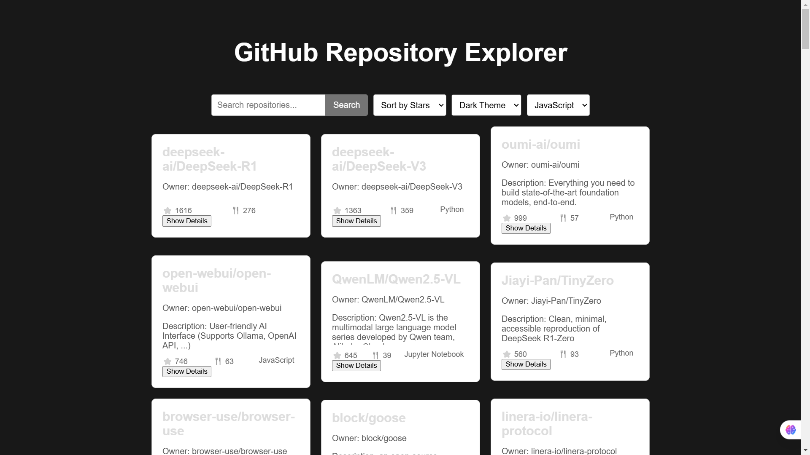
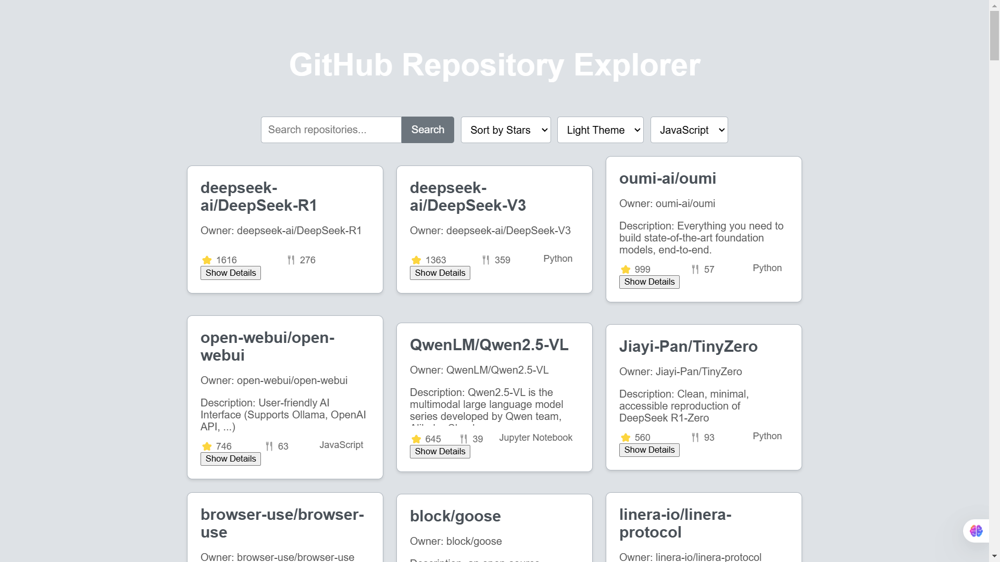
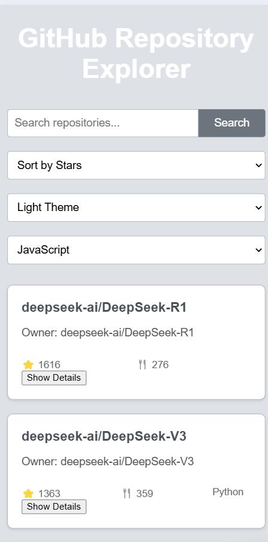
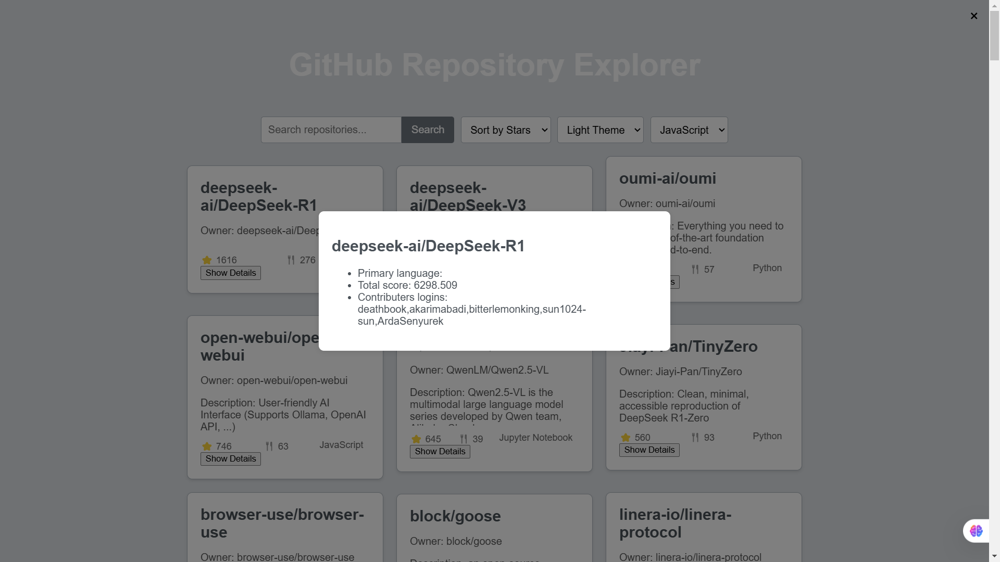

# Project: GitHub Repository Explorer

## Introduction

The GitHub Repository Explorer is a web application designed to help users discover and explore trending GitHub repositories. Built with React.js, the application provides an intuitive and responsive interface that allows users to search for repositories, sort them based on various criteria, and view detailed information about each repository. Whether you're a developer looking for inspiration or a tech enthusiast curious about the latest projects, the GitHub Repository Explorer has you covered.

## Features

- **Trending Repositories:** View a list of trending GitHub repositories with essential information such as name, owner, description, stars, forks, and primary language.
- **Search Functionality:** Easily search for repositories by name, providing a quick way to find specific projects.
- **Sorting Options:** Sort repositories based on stars or forks to see the most popular or actively developed projects.
- **Filter by Language:** Filter repositories by programming language to find projects that match your interests.
- **Theme Switching:** Toggle between light and dark themes to suit your visual preferences.
- **Responsive Design:** Enjoy a seamless experience across all devices, from mobile phones to desktop screens.
- **Detailed View:** Click on a repository card to view detailed information in a pop-up modal, including open issues, watchers, license, and more.

## UI/UX Details

- **Clean and Modern Design:** The application features a clean and modern design with a cohesive color palette of dark grayish green, medium grayish green, light grayish green, and very light grayish green.

- **Intuitive Navigation:** The layout is designed to provide easy navigation with a fixed header and footer, ensuring that key controls are always within reach.
- **Accessible Search and Sorting:** The search bar and sorting options are prominently placed, making it easy for users to filter and sort repositories according to their needs.
- **Responsive Grid Layout:** The repository cards are displayed in a responsive grid layout that adapts to different screen sizes, ensuring an optimal viewing experience on all devices.

- **Interactive Elements:** Buttons and interactive elements are styled to provide clear feedback on hover and click, enhancing the user experience.
- **Modal for Detailed View:** The detailed view modal provides a focused view of repository information, with a close button for easy dismissal.

## Technical Stack

- **Frontend:** React.js, HTML5, CSS3
- **Styling:** Flexbox, CSS Grid, Responsive Design
- **API Integration:** GitHub API, OSS Insight API
- 
## Team Members

- **Adnan Pathan:** Frontend Developer
- **Ashwini Kotagonde:** UI/UX Designer
- **Anish:** Project Manager